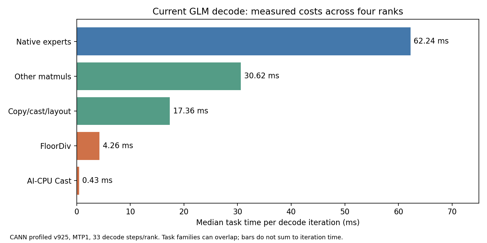

# GLM 310P：compact prefill 与 AI-Core integer metadata

接续 [selected KDA state pages](../prefill-state-rows-20261007/README.md)。当前保留
`native_v919_prefill_v913_decode_state_rows_v925_compact_integer_v938`：MoE prefill v919 /
decode v913、selected KDA pages、compact pool writer、exact AI-Core integer division。
同一组四个 worker、同一权重 storage digest；永久磁盘权重没有重新转换或加载。用户判读文本质量。

## 保留的改动

- 永久 indexer loader 使用 per-instance bound methods；改 class 不会覆盖它们。
  `InstanceBindings` 替换 main/draft 的12个 indexer、24个 methods，下一次切换先恢复；
  capture/apply 使用明确的 immutable hooks，防止旧 capture 重新安装自己的 wrapper。
- Compact prefill 只压缩候选 completed pools、保留必要的 MTP tail，640输入行通常对应160个
  pool rows。`preserve_cache_dtype=True` 保留永久 compressor 的 FP16输出与原 BF16 rounding，
  不添加 BF16 GM temporary。小 decode 继续使用永久 writer。
- Exact INT32/INT64 division 支持4/160/640，负 remainder 做 floor 修正，不经过 FP32。
  每core拥有完整64-element output tile，UB结果一次 DMA写入，尾部32-byte padding有明确所有者。
  一次90 KiB传输预准备1..640元素的3840个 descriptors；这不是 weight preparation。
- Private Torch proxy仅拦截支持的 device、dtype、divisor和floor调用，其余保持原 Torch。
  不改变 process-wide Torch，也不添加环境变量、模型文件或 model-runner行为。

## 在线测量与资格

完整结果：[validation.json](measurements/validation.json)，原始 trial、SSE events、worker receipts
与 server logs在 `measurements/`；源与控制器在 `protocols/`。HTTP请求使用真实已加载模型，
固定 ID42/seed42，cold1280输入/1输出及128输入/64输出，每variant两次交错测量，主动清 prefix。
Decode口径是首个可见文本到 SSE DONE 的63个后续输出 tokens，包含 MTP与终止开销。

| 比较 | Cold1280 median | Decode median | 决定 |
| --- | --- | --- | --- |
| v935 → compact v936 | 13.3576 → 13.0857 s，减少2.04% | 8.465 → 8.710 tok/s | 保留compact |
| v936 → bound integer v938 | 13.0497 → 13.1313 s | 8.458 → 9.198 tok/s | 按用户要求保留AI-Core |
| v938 → quotient/remainder v940 | 13.1229 → 13.0658 s | 8.873 → 8.077 tok/s | v940仅opt-in |

Decode差异尚不能作为稳定加速结论，更没有证明10 tok/s。
[iteration audit](measurements/v940-decode-iteration-audit.json) 未发现其它并发请求：
v940两次分别需要32/44个 generation iterations输出64 tokens，median step为202.62/203.38 ms；
v938分别36/33次，206.68/191.49 ms。MTP接受率显著影响端到端吞吐，不应仅根据两个median判断。

最终功能请求再次验证：四rank source SHA一致、640 segmented graphs至少两次replay、
compact writer均执行、native expert fallback为0、graphs clean、native未失败，服务已恢复unpaused。
Compact writer的正常小decode委托计数不等于expert fallback。
TP4 / MTP1 / batch640 / max-seqs4 / max-model-len311040，FULL decode2/8；
640 prefill仍是46 graph segments与45 eager boundaries，不能称为全流程没有eager。

## 四rank CANN证据与下一步

`profiles/`保留 v925、v928、v938、v940 的四rank原始 CANN CSV、step markers与汇总；
各task families可重叠，profiler时长不能当作无profiler吞吐。

- v925当前decode：expert tasks约61.5–66.3 ms/step，其他matmul约30.5–31.1 ms，
  copy/cast/layout约17.1–17.6 ms。MAC忙碌时间约1%，SDK cube geometry约93%；两者不可混用。
- v928 trace揭示旧class/hook实验未进入decode：0 native integer tasks、96 CPU FloorDiv/step。
- 正确bound v938：60 native integer tasks（约0.103–0.122 ms）、36 CPU FloorDiv（1.74–1.88 ms）。
  AI-CPU Cast从2增加至14/step（约2.46–2.68 ms）；不能宣称已消除AI-CPU casts或全pipeline加速。
- v940 writer remainder改写数学通过，但trace仍有36 CPU FloorDiv，native tasks增加到72。
  因而“剩余36来自这些writer remainders”的归因被推翻。它没有达成消除任务的目标，未保留。
  下一步需映射这些残留FloorDiv和新增Cast的实际来源，再融合producer/consumer。



## 测试、失败记录与复现

150个scoped CPU tests通过；60个signed division/replay/padding NPU gates、60个remainder算术
changed-input graph gates、两个各48例的full-cache byte comparisons通过，涵盖FP16/BF16输入、
pool continuation、MTP0/1、empty requests、page/row gaps与guards。prepared-descriptor54例亦通过。
Operator parity是必要门；未运行文本质量评分，其它buildout尚未验证。

v926交错GM scalar写共享cache line，数值gate失败，未用于服务；v927改为UB/DMA输出。
早期Torch FloorDiv micro comparator无法直接NPUGraph capture，故native-only micro计时不作为加速证据。
v927/v928 shadow只实际覆盖prefill，decode执行证据不足；不得用false mismatch flags作decode资格。
v931 transition旧hook重装wrapper导致capture错误，v932/v935恢复canonical permanent bindings，
没有重启workers。v940初始CPU草稿暴露字符串替换precedence问题，加括号后通过，再进入NPU/live。

从既有运行环境执行；新build必须使用尚不存在的目录与版本：

```bash
python -m tools.glm_perf.build_integer_divide \
  --build-dir /tmp/glm-integer-vNEW --version NEW \
  --cann-root /usr/local/Ascend/cann-9.1.0 \
  --source-root /srv/ai/src/glm-selective-w3-nz-test-20261004
python -m tools.glm_perf.integer_divide_probe \
  --build-dir /tmp/glm-integer-vNEW --output /tmp/integer-gates.json
python tests/e2e/nightly/310p/single_node/ops/test_integer_divide_310.py \
  --integer-build-dir /tmp/glm-integer-vNEW
```

`integer_divide_control.manifest`检查signed/replay/padding coverage与binary/helper hashes。
冻结source使用`.py.txt`或`.cpp.txt`；恢复原名并核对hash后运行。Logs、大JSON与CANN CSV使用gzip，
`raw-file-hashes.json`记录每个解压后SHA256、长度及remote原路径。完整raw profiling约167 MiB，
保留OP attributes以便继续定位残留任务。CPU fixtures使用当前worktree/deployed baseline源码，
在 `runtime-source/`中冻结，未把其它未提交runtime改动混入本次commit。

服务API：`http://192.168.53.187:8001/v1/models`；日志：
`/home/matteius/experiments/glm-reconstruction-20261006/serve-native-disk-head-nz-recovery-20261007-v2.log`。
