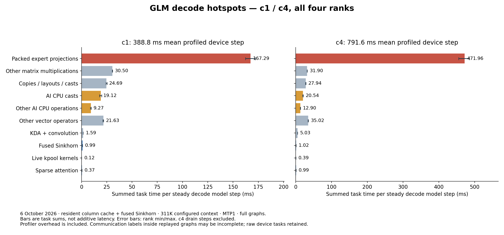

# Resident all-rank GLM decode trace

## Capture

Fresh c1 and c4 captures completed on all four Ascend 310P ranks on
6 October 2026 UTC. Each request generated 32 tokens. Context was configured
at 311040, with MTP1, full decode graphs, the qualified KDA column cache,
completed pools, and fused Sinkhorn. These are short-context captures at that
configured capacity; full-length context was not exercised.

The capture uses the deployed CANN `acl_prof.h` interface directly. It does
not install torch profiler allocator hooks or use a warmup schedule. Two
disposable-process capture/stop cycles passed 40 profiled and 20 post-stop
native graph replays before live collection. `ASCEND_LAUNCH_BLOCKING` was
verified disabled in every worker's environment without saving that
environment. Native profiler collection stopped and finalized before graph
recapture. A fresh eight-token request passed after restoration.

Worker PIDs **2512274 / 2512653 / 2513147 / 2513520** and weight-storage
digests remained unchanged. Serving returned to `completed_pools_sinkhorn`
on port 8001; this study does not change model arithmetic.

Raw exports remain on Threadripper under:

```text
/home/matteius/experiments/glm-decode-trace-20261006/{c1,c4}/rank{0,1,2,3}/
```

Each rank includes CANN `op_summary`, `task_time`, runtime timeline JSON,
communication statistics, and `step_trace` exports. Source file SHA256s and
explicit phase boundaries are in [attribution.json](attribution.json).
CANN iteration markers are matched to scheduler steps and checked against
host timestamps. Device end markers can follow host sampling returns because
the marker is queued on the stream; this offset is recorded per step.

## Measured hotspots



Packed expert projections are the largest identified task family on every
rank. They total **2.60–2.75 seconds** within the 6.23-second c1 decode
interval, and **7.56–8.02 seconds** within the 13.18-second c4 decode
interval. These task sums can overlap other streams and are not additive
critical-path savings. Profiling changes request latency; use separate
unprofiled serving runs for throughput claims.

AI CPU casts contribute **286–320 ms at c1** and **327–364 ms at c4**.
Their graph exports omit tensor dtype/shape metadata, so the exact source
conversion still needs attribution. This is measured device CPU work, not
evidence of a host `.double()` fallback.

The native `glm_sinkhorn_normalize_v1` tasks are present. The native mHC post
flag remains restricted to 640+ tokens in the baseline and therefore does
not fuse decode post. This is a concrete remaining eager path. A subsequent
resident fusion experiment is in the neighboring eager-fusion study.


c1 has 16 decode model steps. c4 has 17, including request drain; its hotspot
chart excludes drain steps. MTP target verification and draft work are both
included in each model-step interval.

## Limits and follow-up

All-rank c1/c4 collection is complete. **Complete dependency-chain
critical-path attribution remains incomplete.** Communication labels inside
replayed graphs are incomplete in the operator summaries. Raw task exports
also contain unlabelled graph AI Core work, device reduction/copy tasks, and
event waits. A gap between named operator tasks is not proof of idle hardware.
Runtime timelines and raw device tasks are retained for that analysis.

The earlier review's emphasis on measuring the whole model was justified.
Its statement that no current all-rank trace exists is superseded by this
capture. Its suggestion that mHC must be the largest cost is not established
by these measurements. Qwen/GLM throughput ratios and a proposed 10–15 tok/s
ceiling are not hardware limits demonstrated by this study.

Two controller issues were corrected before the completed capture:

- A zero-token scheduler cleanup pass was initially treated as an unfinished
  model step. Zero-token passes now bypass step recording.
- Utility RPCs can return stale acknowledgments. Start/stop mutations are
  sent once, then confirmed with pure worker-status polls. Collection is
  finalized before changing serving dispatch.

Failed attempts are retained remotely as `first-attempt` and
`transport-attempt`; they were not used in the reported attribution.
