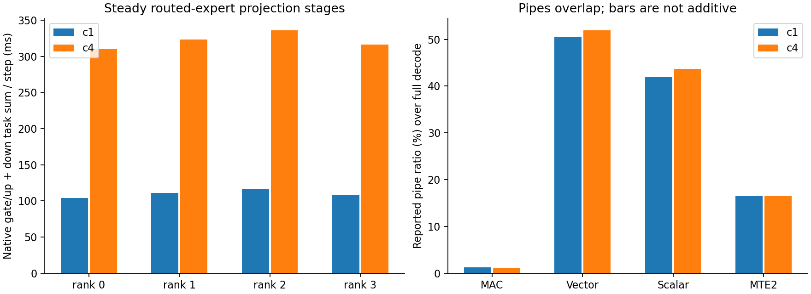

# GLM native INT4：消除 AI-CPU Cast、删减数学与路由工作

真实 selective-W3 永久布局、TP4、四个 310P3 rank（两张卡）、MTP1、ACL decode
图 sizes 2/8。使用现有热服务 `:8001`；所有切换保留 workers 和 bank storage，
每次重捕图约6.2秒，零在线重排、零 layout backup。未重新运行旧 FP16 baseline。

当前热服务为 **native MoE v41 + indexer v5**：c1 **7.639 tok/s**、
c4 aggregate **12.219 tok/s**、quality **18/20**、26个请求有效。最终四 rank
c1/c4 trace 全部 decode steps 均为 **0 AI-CPU Cast**（原为139/step/rank），
每step仍完整执行43个gate/up和43个down。尚未达到c1 10 tok/s。

## 实现与验证

- v31：只转换 active Cube rows，删掉 full-M16 padded-row Cast 和后续向量拷贝；
  SwiGLU、accumulator、down epilogue 也只处理 active elements。
- v32：保留原 FP16 scale rounding，整块转换回 FP32，避免内层每行重复转换。
  端到端收益不明确，不能宣称 FP32 cache 本身更快。
- v33：单独尝试 FP16 SwiGLU。严格算术 gate 未通过；12个真实 expert 对照只有
  1个在容差内，最大差0.07324。两-token gate/up普遍略慢；不进入热服务。
  **这仅否定该具体变体，不能证明 FP16 数学本身没有优势。**
- v34：将八次逐 strip Cast 改为 INT32 gather + contiguous Cast。更多 active rows
  的 gather 变慢，后续只对 single-row 使用。历史 v34 down 的 UB 分配还进入了
  SDK 临时区域；不将这一版本作为发布候选。
- v35/v36：把每次量化的512个 offsets、8个 reduction indices 移到每 core 一次。
  新表导致 UB 超出 usable 区域，17-token gate 出现 NaN；未进入热服务。
- v37：只保留 single-row gather 表，独立保存 quantizer 的常量 metadata。
- v38：A4量化从 `FP32→INT32→FP32→FP16→INT4` 改为
  `FP32→INT32→FP16→INT4`；310P的 `vconv_deq` 必须显式设 `DEQSCALE=1`。
  最近偶数 rounding 仍在 FP32 做，整数 clamp 改用 FP16，保持 code 精确。
- v39：直接构造 stable route order 与 cumulative group ends，删除 generic
  descriptor 中未被 fused kernels 使用的 inverse permutation、token indices、
  route weights 与 cumsum；算术 gate 也改为通过完整 `NativeFusedMoE.__call__`。
- v40：把 byte 内字段的 sign extension 合并进 integer mask，删除 W2/W3
  重复的 `FP16→INT16→FP16`；跨 byte W3 字段继续按整数拼接。
  exhaustive CPU gate 覆盖全部256个 byte 值、全部合法 phase、W2/W3/W4。

SDK `__NPU_ARCH__=2002` 的 `TOTAL_VEC_LOCAL_SIZE` / `TMP_UB_OFFSET` 为248 KiB，
physical UB为256 KiB。device `InitBuffer` 不做 cumulative bounds check。
最终 gate/up分配247136 bytes、down253248 bytes，均低于253952；源码新增
compile-time assertions，阻止常量表再次覆盖8 KiB临时区域。

各版本 `.bin` / bridge / frozen helpers 与 `provenance.json` 为 append-only。
`kernel-v*-source.txt` 保留实际编译输入，避免后续 formatter 使 source SHA 失配；
控制脚本 `.txt` 是实际远端执行脚本，可直接用 Python 运行。gate reports 标明
exact binary hashes；real-weight checks 使用 layers10(W3)、11(W4)、33(W2)。

所有实测版本保持原 W2/W3/W4 codes 与 FP32 scales；W2/W3在 UB 扩展到 INT4，
W4直接读取 Cube bytes。Cube products 为INT32，projection scaling/accumulation
和 route reduction 保留FP32。indexer保留原数学/rounding，转换实现见下文；
dense/shared专家保留现有实现。

## 端到端结果

固定64-token短请求：c1一个请求、c4四个请求；20个quality cases按四并发分组，
最后一个tool请求。每个试验26个有效请求，tool1/1；这是单次试验，未建立置信区间。

| 版本 | c1 tok/s | c4 aggregate tok/s | quality | 热切换秒 |
| --- | ---: | ---: | ---: | ---: |
| v29、上一轮已保存 | 6.517 | 10.654 | 18/20 | — |
| v31 | 6.635 | 10.774 | 17/20 | 6.20 |
| v32 | 6.588 | 10.790 | 17/20 | 6.26 |
| v34 | 6.929 | 10.198 | 16/20 | 6.24 |
| v37 | 6.564 | 10.978 | 17/20 | 6.22 |
| v38 | 6.798 | 11.305 | 18/20 | 6.23 |
| v39 | 7.044 | 11.493 | 17/20 | 6.20 |
| v40 | 7.392 | 11.037 | 17/20 | 6.17 |
| v41、仅 routing INT32 reduction | 6.978 | 12.689 | 18/20 | 6.23 |
| v41 + indexer v5 | 7.639 | 12.219 | 18/20 | 6.31 |

v40 c1比已保存v29高13.4%，c4高3.6%；与v39相比，c1改善而c4回落，不能声称
所有并发场景均更快。原始 default已保存c1 5.190、c4 14.401；当前native路径
仍未超过原始default的c4吞吐。尚未达到c1 10 tok/s。

v40 quality17/20：`instr_reverse`回复`pial`（应为`pmal`）、`instr_first`回复`Red`
（应为`red`）、`code_slice`带额外引号/反引号。不同版本16–18/20；真实expert
bitwise checks不证明整模型回复完全一致。本轮没有宣称消除了这些quality失败。

v40通过36个independent arithmetic/changed-input-route-weight graph gates，
18个真实expert bitwise checks（tokens1/2/8 × A4/A8 × W2/W3/W4）。v39的24个
routing graph gates覆盖tokens2/8/128/640、INT32/INT64 ids、三个expert offsets，
与独立CPU稳定排列/累积边界完全相同，zero-weight replay通过。
CPU focused tests **108 passed**；`--noconftest`避开本机缺失的upstream组件，
不等于完整repo suite。指定文件的manual pre-commit checks另行完成。

## 四 rank CANN trace

v39 raw PROF/CSV/timelines 位于远端：

```text
/srv/ai/artifacts/glm-native-active-rows-20261006/trace-v39/
```

该 trace 使用c1/c4各32 output tokens/request、nonce prompts；用于 task attribution，
不是未开启 profiler 的速度样本。stop/finalize后再恢复原候选并重捕图，同 workers
与 weight storage，post-trace request通过。与v29 trace比较时按 decode step归一化，
不把等待 task 的累计时间解释为有效计算或 critical-path idle。



| steady decode、每step归一化 | v29 | v39 |
| --- | ---: | ---: |
| c1 native gate/up+down summed ms/rank | 116.8–121.4 | 104.3–116.3 |
| c4 native gate/up+down summed ms/rank | 344.2–367.7 | 310.1–335.8 |
| c1 AI-CPU Cast ms/rank | 18.3–20.8 | 19.1–21.3 |
| c4 AI-CPU Cast ms/rank | 19.5–22.1 | 19.7–22.3 |
| 每step AI-CPU Cast count/rank | 139 | 139 |

两次trace每个steady step均43个gate/up、43个down，覆盖main42层+MTP1层。
v39 vector ratio约50–52%，scalar约42–44%，MAC约1.2%；相比v29 scalar ratio下降，
但pipe ratios有重叠且workload nonce/route occupancy不同，不当作受控bit-width收益。
**v39没有减少AI-CPU Cast数量或每step时长**；之前未使用的routing metadata删减
不能据此认领这些Cast的收益。后续 isolated routing capture 已定位 bool→INT64 sum 的 Cast；以下记录最终修复。
Vec是vector engine，负责cast、bit-mask、scale、SwiGLU、gather/reduction；
scalar负责地址、循环/分支及单值加载；Cube负责矩阵乘法。MTE2表示数据搬入活动，
不等于每个内存访问均为critical-path瓶颈。完整dependency DAG仍未重建。

`analyze.py`使用原来的bank ownership load reports，因本轮所有worker PID与
weight storage相同且expert bank布局未变；逐step核验stage数量后才关联layer bits。
此trace为v39，不能当作v40 folded-sign版本的pipe counters。

## AI-CPU Cast 的定位、修复与完整验证

isolated routing graphs 每case replay43次：INT64→INT32、INT32→FP32、stable
FP32 argsort 均为AI-Core；bool `.sum()` 默认INT64每次产生一个AI-CPU Cast，
平均120–128 µs。`.sum(dtype=torch.int32).to(torch.int64)` 不产生AI-CPU Cast，
ABI、stable order、zero-weight/peer过滤不变；routes最大65536，计数不会溢出。
v41保持36个完整MoE gates、18个真实expert bitwise checks、24个routing replay gates。

其余96个Cast来自12个DSA indexer（含MTP）的BF16转换，每层8次。新增
`glm_bf16_cast.cpp`，用AI-Core bit conversion 保持BF16最近偶数rounding；
分别实现FP32/FP16→BF16、BF16→FP32/FP16。转换gate检查特殊值、signed zero、
subnormal、overflow、非对齐tail与changed-input replay。FP32→FP16 AI-Core原生
cast对overflow饱和而旧BF16→FP16产生infinity，因此不能以简单两次cast替代；
新增converter直接产生匹配的IEEE half bits。v3通过32个转换/replay checks。

indexer v4用该converter替换query cast、pool compression rounding、旋转输入输出
和cache写入转换，c1/c4四rank全部decode steps已为0 AI-CPU Cast。indexer v5继续
合并`FP32→BF16→FP32/FP16`；在UB执行rounding并直接输出目标类型，每层少3次
kernel launch及BF16 GM临时张量。最终trace **60个BF16 kernels/step/rank**，
此前96个，减少36个；48个转换/round-through-BF16/replay checks全部bitwise通过。
8个完整compression checks覆盖rows1/2/8/128、FP32/BF16输入，BF16和FP16输出
均bitwise等于原NPU链。FP32 softmax、pool求和、Hadamard顺序未改。

| 完整服务decode trace | c1 | c4 |
| --- | ---: | ---: |
| 原v39 AI-CPU Cast/step/rank | 139 | 139 |
| indexer v4、四rank | 0 | 0 |
| 最终indexer v5、四rank | 0 | 0 |
| 最终BF16 native launches/step/rank | 60 | 60 |
| 最终gate/up、down launches/step/rank | 43、43 | 43、43 |

v4 profile每请求32 tokens，最终v5每请求16 tokens，nonce prompts；均含main与MTP。
最终四rank每workload各8个decode steps，stop/finalize后重捕图并恢复v5，
post-trace request通过。固定64-token速度来自独立未开启profiler的26-request trial，
不用profile窗口作为吞吐结果。v41单独trial的部分kernel qualification与benchmark
时间相邻，速度不用于归因routing本身；最终trial未并发执行NPU qualification。

最终quality18/20仅`instr_first`输出`Red`（应为`red`）和`code_slice`输出反引号包裹
的`lan`；未宣称大型accuracy gate通过，也不以bitwise专家检查替代整模型评估。

一次hot-load manifest误把已编译的`glm_bf16_v3`写成`glm_bf16_v4`，服务保持paused。
校验四rank的pending assets和实际registered operator后，仅纠正operator声明，
沿标准load/validate流程完成同一binary的验证；未手动跳过validation或清除failed flag。
恢复同workers和weights，再载入真正的v4 binary。现`bf16_control.py`从同一namespace
生成constructor与operator，并要求exact binary/helper hash绑定的gate reports，
UT覆盖namespace一致性与错误binary拒绝。

## 永久磁盘bundle与启动组合

checkpoint `native-layout.json`现在引用`native-kernels-v41`和`indexer-kernels-v5`。
旧bundles保留，weight/index/shard bytes未改，发布零在线weight transformation。
loader通过optional `indexer_kernel_bundle`组合每个已加载Indexer实例及其pool writer/
selector，无global class patch；保存的BF16rounding与score kernels在下次启动自动生效。
manifest校验binary/helper/quality-gate hashes，避免从实验build目录取未冻结代码。

native MoE bundle在fresh process通过6个arithmetic/replay gates。indexer bundle的
fresh-process检查使用实际Indexer/SparseAttnIndexerKpool类型、无projection weights，
验证instance绑定、class不变及15个native rounding cases；**这不是完整model重启**。
真实完整模型证据来自上述hot服务请求和所有rank traces。完整重启未执行。

## 复现与边界

```bash
python -m tools.glm_perf.build_reconstruction \
  --build-dir /path/to/NEW-build --version UNIQUE_VERSION \
  --output-columns 128 --tile-pipeline --all-bits --fused-moe \
  --prepared-weight-layout --pair-scale-groups
```

`--fp16-swiglu` 只作为 opt-in 算术实验，必须经过完整 matching gates，当前变体
没有通过；默认关闭。不要改动已载入的 bridge/helpers/binaries，不要重新处理
永久 checkpoint 的 codes。新 bundle 必须独立复制并校验，再原子切换 manifest。

CPU focused tests 与真实权重、changed input/route/weight graph gates均有证据。
这仍是短 context / 小型 exact-answer suite，没有满 context、perplexity 或大规模
accuracy qualification。quality score会随试验变化，单 expert bitwise gate不能
直接证明整个模型回复完全相同。固定64-token benchmark与提前 EOS 的质量请求
分开，后者9–12 tok/s不作为 c1达到10的证据。

硬件/容量沿用现有服务：context配置311040、max sequences4、batch640；本轮没有
重新测试16 sequences。ACLGraph与MTP真实权重已验证；EP/flashcomm1没有在本轮
重配，GLM本检查点的多模态任务不在这次性能试验范围。永久 model loader与启动
命令见[上一轮永久布局报告](../native-prepared-20261006/README.md)。
