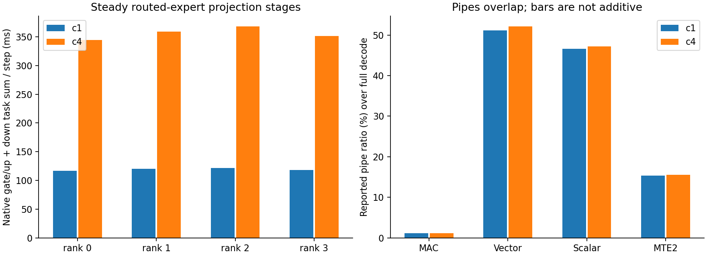

# 永久布局 GLM v29：四 rank CANN profiling

真实 selective-W3 native checkpoint，四个 Ascend 310P3 rank（两张卡）、TP4、MTP1、
ACL decode graph sizes 2/8、context 配置311040。c1 与 c4 各生成32 tokens/request，
使用 nonce prompt 清除重复前缀影响。这是短 context trace，没有测试满 context。

直接 CANN `acl_prof.h` lifecycle 及 PipeUtilization counters，不安装 Torch profiler
allocator hooks。start/stop 各执行一次，通过只读 status 确认；stop/finalize 之后再
恢复 graph dispatch。新 kernel 和永久 banks 全程保持，未换回旧 expert 实现。
同 workers 与 weight storage，最后八-token request 通过；证据见
[restored.json](restored.json)与[post-trace-request.json](post-trace-request.json)。

原始 PROF、timeline、CSV 留在 Threadripper：

```text
/srv/ai/artifacts/glm-native-trace-20261006/{c1,c4}/rank{0,1,2,3}/
```

[attribution.json](attribution.json)记录全部八个 CSV 的 hashes、host/device step
对应、prefill/decode、c4 drain 边界与 raw task families。每个完整并发 decode step
的 native gate/up 与 down 数量必须与模型 bank ownership 一致，才关联 layer precision。
不同层的 bit-width 时序不是控制变量 quant 对照：activation 与 routing occupancy 不同。

Profiling 会改变时序；服务速度用单独的
[unprofiled 26-request trial](../native-prepared-20261006/native-disk-v29-trial.json)：
c1 **6.517 tok/s**，c4 aggregate **10.654 tok/s**，quality18/20，tool1/1。
本轮没有重复运行 baseline。服务使用永久 native checkpoint；main/MTP loader audits
均为零 transformed codes、零 layout backups。

## 实测 decode 热点



| 并发 | 稳态 decode window 秒 | Model steps | Native gate/up+down task sum 秒/rank | AI CPU Cast 毫秒/rank |
| --- | ---: | ---: | ---: | ---: |
| c1 | 5.072 | 16 | 1.870–1.942 | 292.7–332.2 |
| c4、保持四 requests | 9.664 | 15 | 5.163–5.515 | 292.4–331.1 |

c4 完整 decode（含 drain）为18 steps、10.991秒；前面还有两个 prefill steps。
不能将第一个 prefill 之后的所有 tasks 都算作 decode。本轮每个稳态 step 的
43 个 gate/up 与43个 down均匹配 main42层+MTP1层，所有 W2/W3/W4 owners 都存在。
旧 `w2_grouped_blocked_dequant` expert task family 为零；图中其他 grouped matmul
属于保留的非 expert 路径，不能仅凭名字将其算作 FP16 routed-expert fallback。

完整 decode 的 duration-weighted native expert pipe ratios：c1 MAC1.16–1.19%、
vector50.9–51.5%、scalar46.3–46.9%；c4 MAC1.11–1.13%、vector51.7–52.4%、
scalar47.0–47.4%。MTE2约15–16%。pipe ratios会重叠，不能相加当作百分比分解。
这些 counters 与源码中频繁 per-scale-group barrier、scalar scale读取及 vector
重排/缩放相符；**这是基于 trace + 源码的归因推断**，不是每条指令的独立计时。

按 layer precision关联的 rank0稳态 counters也符合重建路径差异：W4 gate/up/down
的 vector ratio约34–38%、scalar55–57%、MAC1.48–1.58%；W2/W3的 vector约59–62%、
MAC0.84–0.98%。其他 rank完整数值在 attribution 的 `layer_associated_precision`
中。W4的瓶颈更偏 scalar调度，W2/W3更偏 UB扩展；不是 Cube arithmetic宽度不同。

原生 W4层已表现出更低的平均 stage time：c1 gate/up1.26–1.38ms、down0.65–0.71ms；
W2层为2.19–2.37ms/1.11–1.20ms，W3层为2.40–2.73ms/1.22–1.38ms。W4直接读取
Cube bytes，W2/W3还要UB扩展至INT4。层的路由占用与 activations不同，因此这里
**不是**“W4比W3快X倍”的受控结论，也不能把这些 ms换算为模型吞吐倍数。

Raw EVENT_WAIT union几乎覆盖整个 decode，并且其 summed time大于 wall window。
它包含并行依赖等待，不能解释为“通信浪费了整个窗口”。保留 raw任务与通信统计；
仍需完整跨-stream依赖链才能定位真正同步 critical path。AI CPU Cast缺少 graph
export的 dtype/shape字段，尚不能准确归到某个 Python conversion。

下一轮按此证据优先检验：

1. 只 cast/重排 active Cube rows，删除当前 full-M16的 padded-row vector work。
2. 在更大 Cube操作中容纳更多独立 scale groups，减少 per-group readback/barrier；
   必须保留每个 K32 group的独立 scale与累加顺序并重新做 bitwise/quality gates。
3. 定位并消除重复的路由 metadata conversion 与 AI CPU Cast；不以降低 weight bits
   替代该工作。W2/W3/W4当前都使用INT4 Cube，降 bits不会再降低Cube arithmetic宽度。

以上是下一轮实验方向，未将未实现的优化算作本轮速度收益。

## 启动路径的 host profiling

直接 safetensors mmap→NPU 的首轮在驱动页 pinning 上停住。3秒 perf capture 的
529 samples 指向 `pin_user_pages_fast` / `devmm_ioctl_memcpy_process`，经过
huge-page splitting 与 TLB flush；[stack report](startup-stack-report.txt)。
普通 CPU storage 的单 tensor byte-copy staging 修复了本次载入；未做量化或重排。
主模型 load_weights42.53秒、draft1.31秒，总 load_model48.46–48.84秒。
[修复后 Python stack](startup-staged-python.txt)已经进入普通 dense weight loader。

## 范围限制

Task sums 与 pipe ratios可以跨 streams/流水线重叠，不是可直接相加的 critical path。
raw EVENT/NOTIFY waits 是依赖等待，不能当作有效 Cube 计算。没有 named task 的
间隔不能证明硬件 idle。本轮仍没有完整通信依赖 DAG；cluster tuning exporter
警告不等于模型失败。SDK 的 `cube_utilization(%)` 与 `mac_ratio` 是两个指标，
本文不将前者直接解释为整个 kernel 的 MAC busy fraction。
