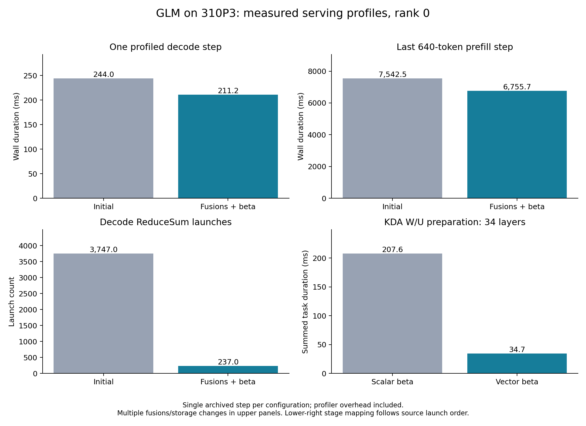
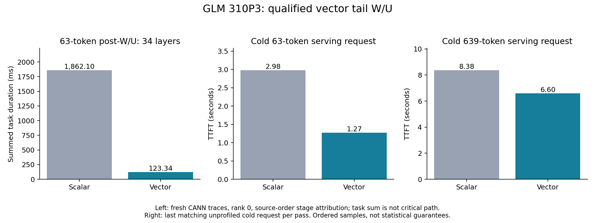

# GLM overnight performance work, October 8

This batch removes repeated vector/scalar work and memory copies in the existing
GLM 310P3 runtime. The FP16 expert-scale disk contract remains
`fp16_storage_fp32_compute_v1`; expert Cube arithmetic and FP32 accumulation are
unchanged. These are measured performance experiments, not a model accuracy
qualification. The user evaluates generated-text quality.

## Retained serving changes

- Selected-row KDA state gather/scatter replaces copies of the entire persistent
  state bank. The native resource is v925, previously qualified.
- v971 normalizes independent 4×4 Sinkhorn matrices on the vector unit. It retains
  PyTorch's different row-sum order below and at/above 128 rows. All 210 hardware
  cases match exactly, including changed-input graph replay and buffer guards.
- Fused v941 QSA metadata is composed with existing graph capture. Descriptors
  are prepared from host shapes; the frozen legacy helper gets a private API
  adapter. Tested serving shapes report zero metadata fallbacks.
- Completed KPool writes operate on completed keys and retained state tails,
  preserving the permanent compressor and FP16 key-cache output. v927 integer
  arithmetic is used where qualified. Permanent converter descriptors are
  rebased before capture instead of keeping allocations from retired graphs.
- v975 replaces scalar BF16 conversion modes 0/1/4/5 on both permanent
  target/draft converters. Mode 2 keeps the earlier qualified query converter;
  mode 3 retains its existing implementation. All 76 hardware cases pass,
  including exhaustive BF16 bit patterns, FP16 rounding boundaries, input/output
  guards, changed replay and the full 640×32×128 shape. FP32-to-FP16 uses
  `CAST_NONE`: `CAST_RINT` did not implement the required 310P rounding behavior.
- The complete KDA vector beta candidate retains FP32 beta products and the
  terminal FP16 round, using separate input/product/output buffers. All 17
  safe-gate cases match every returned output and recurrent-state byte, repeat
  exactly and preserve inputs. The complete 640-token operator takes about
  34.74 ms versus 39.86 ms. Its new package replaces only the existing KDA vendor
  slot; host libraries and serving settings stay the same.

The standalone beta diagnostic has 70 shape/layout cases with six changed replay
values each. Its frozen v978 probe and executed source hashes match. Two broader
nonsafe KDA cases are already nonfinite in the parent and do not qualify this
candidate. The production GLM path keeps safe gating enabled.

## End-to-end measurements

Temperature zero, forced 128 output tokens for generation timing; first-text
TTFT and `(completion_tokens-1)/(last_text-first_text)` for generation. Cold
requests clear scheduler prefix state. The two generation prompts are synthetic
token-ID sequences, and their high speculative acceptance is not representative
of every text workload. Each table row is one ordered serving pass, not a
replicated statistical comparison.

| Serving candidate | C1 generation, two prompts | Cold 640 TTFT | Cold 6,400 TTFT | C4 total throughput |
| --- | --- | --- | --- | --- |
| Vector conversions + other fusions | 9.67 / 10.32 tok/s | 6.16 s | 72.85 s | 9.96 tok/s |
| Same fusions + W4 down7 disk layout | 9.75 / 10.31 tok/s | 6.20 s | 73.09 s | 9.95 tok/s |
| Same W4 layout + vector beta KDA | 9.50 / 10.46 tok/s | 5.99 s | 70.84 s | 10.02 tok/s |
| Beta + qualified full-chunk score reduction | 9.63 / 10.16 tok/s | 5.85 s | 70.32 s | 10.23 tok/s |
| Same W4 layout + vector tail W/U | 9.69 / 10.29 tok/s | 5.85 s | 70.07 s | 8.69 tok/s |
| Original smaller layout + all qualified fusions | 10.24 / 10.26 tok/s | 5.96 s | 69.97 s | 10.02–10.11 tok/s |
| Smaller layout + gated-key reuse | 10.07 / 9.51 tok/s | 5.63 s | 68.17 s | 10.00–10.68 tok/s |

C4 includes prompt processing and is not aggregate steady-state decode. Real-text
C1 with vector beta is **9.27 / 8.63 / 8.96 tok/s** on three direct completion
prompts. These are timing samples, not chat-template correctness or quality
checks. There is no evidence yet for a consistent 10 tok/s on real text.

The permanent W4 down7 variant changes seven W3 down-projection banks to lossless
W4 storage and adds **504 MiB per rank**. Its real-weight paired operator fixture
is bit-identical for 2/8/640 tokens, both decode/prefill schedules and changed
replay. Dense three-expert decode improves, but the serving table does not show
an end-to-end gain. W3 and W4 already use INT4 Cube math here; this promotion
changes reconstruction/storage only. Keep the on-disk variant as an experiment,
not an asserted throughput improvement.

Draft-only A8 was also tried without changing target A4. Its real-text rates were
9.48 / 8.26 / 7.23 versus A4's 9.64 / 8.58 / 9.04. Acceptance did not consistently
improve; A4 was retained. Text continuations differ between passes, so this does
not establish a language-quality ordering.

## Serving trace and remaining costs

The figure uses fresh CANN traces, not modeled traffic. Upper panels compare
several changes together and contain profiler overhead. Counts/times below refer
to the last profiled rank-zero step; summed task durations are not a critical-path
breakdown. KDA stage identities are inferred from the source-confirmed nine-launch
order, rather than private stage fields in the trace.

- Decode step: 243.95 ms initially versus 211.22 ms with retained fusions/beta.
- Prefill's last 640-token step: 7,542.48 versus 6,755.72 ms.
- ReduceSum and its MemSet launches each drop from 3,747 to 237 per step.
- KDA W/U preparation across 34 layers drops from 207 ms to 34.69 ms. Score
  finalization still takes 994.72 ms. The safe-gate Cube score stage is a no-op;
  turning safe gating off would risk the known FP16 factorization overflow.
- BF16 conversion in the combined intermediate trace takes 1.04 ms decode /
  2.30 ms prefill; the vector version takes about 0.15 / 0.14 ms.
- AI_CPU FloorDiv remains: 12 calls in decode and 24 in prefill. There are also
  SearchSorted and small reduction/scatter tasks. This is not complete AI_CPU
  elimination or a completely fused prefill graph.

The full-operator sweep exposes a partial-chunk cliff: 63-token KDA calls
were around 60 ms while 64-token calls were about 3.6 ms. Before the tail W/U
change, serving TTFT was 2.98–3.09 s at 63 versus 1.05–1.09 s at 64, and 8.38 s
at 639 versus 5.89 s at 640. The stage trace below identifies scalar post-W/U
finalization as the main cost. Extending the column cache failed qualification
and did not remove the operator latency.

The first vector score reduction matched full chunks but corrupted tails and was
slower on full chunks. It was rejected before serving. Revised reduction batches
partial combination once per row and requires a live full-chunk column cache;
uncached tails retain the reference scalar reduction. A separate bounded partial-cache candidate failed complete qualification: at
63 tokens recurrent state and returned values diverged; shorter multi-chunk
cases also changed the solve matrix. It was never loaded into serving. Its
staging tool records `serving_eligible=false` and the known failure. The
revised full-chunk score reduction passes all 17 safe cases and lowers the
640-token operator from about 35 to 33 ms; its serving selection is recorded below.

## Prefix caching and runtime scope

The initial repeated 6,400-token prompt produces **5,760 actual prefix hits**:
cold TTFT 71.76 s, repeated TTFT 7.55 s. A later vector-beta 1,280-token request
is 12.53 s cold / 6.69 s repeated. Benchmarks that clear the cache deliberately
show zero prefix hits. The last 640-token block is still processed; a hit does
not mean the entire prompt bypasses prefill.

The existing server uses port **8001**, TP4 on four 310P3 chips, MTP1, four request
slots, 640-token chunks and configured context **311,040**. This batch tests up to
6,400 prompt tokens and does not qualify the configured maximum. Decode captures
2/8 tokens. Prefill captures 46 segments with 45 live attention/indexer eager
boundaries. EP and FlashComm1 were not separately changed or qualified;
image/video inputs are disabled. No dummy model was used. The user's existing
four-slot setup is retained instead of the adaptation skill's 16-slot capacity
baseline.

## Evidence and reproduction

Measurements, four-rank switch receipts, source-backed stage attribution and
frozen controller protocols are included here. `qualified-night-kernels.tar.gz`
contains v971/v975 assets; `qualified-kda-beta.tar.gz` contains the complete beta
OPP package plus frozen v978 diagnostic assets. Hash records bind source/binaries
and hardware gates. Original uncompressed CANN traces stay on the NPU host under
`/srv/ai/artifacts/glm-prefill-weight-reuse-20261007/night-speed-20261008/trace-*`.
Large `.pt` references and model shards are not committed. The W4 export/plan JSONs
are gzip archives of the original bytes.

The staging tools verify the parent header SHA and require a new destination.
Compiler flags are opt-in and the production header is not overwritten. Compose
against the already-qualified column-cache parent. Preserve the other OPP slots
and host library order. Drain only the identified GLM process tree before a
package restart; after startup admit the qualified resources, apply the frozen
combined candidate, recapture and resume. Live source-only switches retain worker
PIDs and weight-storage digests. See [runbook](RUNBOOK.md) for the saved protocols.

## Tail cliff attribution

The fresh 63/64-token traces identify **stage 4, post-W/U finalization**, as the
main cliff: 1,862.10 ms summed across 34 layers for 63 tokens versus 1.96 ms for
64. Score finalization is 130.58 versus 92.55 ms; extending the column cache
cannot explain most of the difference. Stage 4 calls `ComputeTailWuRow`, whose
310P fallback loops over output rows, channels and every coefficient using GM
scalar reads. Full chunks use Cube products. The earlier cache-tail rejection
also appears in the [October 5 report](../prompt-profile-20261005/README.md); this
batch reproduced it, and the rejected source is preserved for diagnosis.

The qualified tail candidate uses separate coefficient/value/accumulator/output
buffers and vector-only broadcasts, avoiding the existing scalar-read UB-lane
corruption. It keeps every j term and the descending aliased W-row overwrite
order. Products of two finite FP16 operands are exactly representable in FP32;
the FP32 sequential sum and final FP16 round are retained. Its geometry is
restricted to BT64, 1–63 rows and 128 channels; other cases keep the scalar
implementation. Complete-operator qualification and serving evidence follow below.

The first tail W/U vector build passed aligned 16-token cases and reduced the
63-token operator from 59 to 8 ms, but unaligned coefficient loads corrupted
other tail cases. It was rejected before serving. The corrected candidate loads
the complete BT64 coefficient row, whose 64 half elements are physically owned
by each prepared score row, while looping over valid tail entries only. This
removes the short `DataCopyPad` from that path. The relevant failure/build records
remain in `measurements/kda-tail-wu-rejected-v1-*`.

The corrected tail W/U v2 passes **all 17 safe-gate complete-operator cases**,
including all returned bytes, recurrent state, repeat equality and unchanged
inputs. The 63-token operator is 8.13–8.22 ms versus about 59 ms; 16 tokens
are about 0.96 ms versus 2.9 ms. Complete 640-token calls remain about
32.4–32.7 ms with the previously qualified beta/score fusions. The operator
package is in `qualified-kda-tail-wu-v2.tar.gz`. The package was then loaded into the live server. Repeated cold 63-token
TTFT falls from 2.98 s to **1.27 s**; the first request takes 1.75 s.
Cold 639-token TTFT falls from 8.38 s to **6.60 s**. Full 64/640 requests remain
near 1.04/5.82 s. These are ordered measurements, not statistical guarantees.
The new serving trace lowers rank-zero post-W/U stage 4 for 63 tokens from
**1,862.10 to 123.34 ms** summed across 34 layers, while 64-token stage 4 remains
1.92 ms. Score finalization is still 130.45 ms for that 63-token step.

The exact-bit gates cover complete operators with repeated eager execution;
the separate beta diagnostic covers changed-input graph replay. After restart,
the serving candidate captures decode and segmented prefill graphs with real
weights. This is not a changed-input capture sweep of every complete KDA case.

## Validation and remaining work

The targeted CPU suites pass **1,833 tests** (19 warnings). Three existing GLM
files are excluded because their vLLM/NPU runtime dependencies are unavailable
in the local CPU environment; the validation record lists the command. Complete NPU operator fixtures, the paired real-expert-weight test and real-weight
serving requests provide the hardware evidence.
This is not a full repository test-suite or model-accuracy qualification.

The required `bash format.sh ci` was run. Repository-wide checks fail on existing
formatting, spelling and forbidden-import findings outside this change. Only
incidental formatter changes in the isolated worktree were restored. All manual
pre-commit hooks pass on the owned files after formatting fixes; no allowlist or
hook suppression was added. Concurrent Qwen work was left untouched.

Cold long-context prefill still needs work: score finalization, expert
reconstruction/repeated weight reads, and attention/indexer eager boundaries
remain. Tail vectorization addresses short remainder chunks, rather than the
entire large-context path. The final C4 repeat sweep is reported separately;
there is no established C4 improvement from the tail package.

## Smaller-checkpoint serving selection

The extra W4 down7 checkpoint is retained on disk but was removed from serving,
reclaiming its **504 MiB per rank** weight allocation. All eight native resources,
vector beta, qualified full-chunk score reduction and vector tail W/U remain.
The final configuration recaptures decode and segmented prefill graphs; scale
banks remain 43 per rank / 152,174,592 FP16 bytes. Startup reports 335,184 KV
cache tokens; configured 311,040 context is not a capacity test.

Three C4 passes are **10.03 / 10.11 / 10.02 aggregate tok/s**, including prefill.
Cold 63/64/639/640/1,280/6,400 TTFT is approximately
**1.27 / 1.08 / 6.58 / 5.96 / 12.82 / 69.97 seconds**. The first synthetic C1
request includes first-use overhead; generation rates are **10.24 / 10.26**.
Real-text completions are **9.16 / 7.83 / 7.50 tok/s**. A CPU-only experimental
kernel build overlapped the latter text timing pass, and generated continuations
and acceptance differ; neither this pass nor the earlier samples establish a
causal real-text regression or gain. Do not advertise a consistent real-text 10.

A separate cold/repeated 1,280-token request is **12.59 / 6.74 seconds**, with
**640 measured prefix hits**. Service responses complete, all four ranks are
healthy and graphs clean, and the API is unpaused. Current log and exact startup
arguments are in the runbook and frozen process/launch receipts.

## Gated-key reuse candidate

The next complete operator avoids calculating identical decay-gated key columns
twice for K×K and Q×K scores. It keeps separate column passes and GM-output
fences within each score row, storing rounded FP16 gated keys in a **16 KiB
per-core UB buffer**. Each new first pass resets the writable scratch pointer;
otherwise its previous cached alias would overwrite earlier columns. The first
incomplete build was canceled after that issue was found in review, without any
hardware execution. The corrected v2 is frozen and qualified.

All **17 safe-gate complete-operator cases** match all twelve returned values,
carry, repeats and unchanged inputs. Both broader nonsafe cases remain nonfinite
and are outside qualification. The paired 640-token medians are **32.79→26.14 ms
BSND** and **32.58→25.84 ms BNSD** (seven eager timing samples per case). Tail
geometry is unchanged. No FP16 operations are promoted or reassociated.

The extra compiler flag is opt-in; production source is unchanged. Source/header
and binary hashes, complete gates, the canceled build receipt and frozen build
protocols are saved in measurements. `qualified-kda-gated-key-reuse-v2.tar.gz`
contains the package and deployed headers. Serving results follow below.

## Gated-key reuse serving result

The qualified package is loaded with the original smaller checkpoint and all
other fusions. The ordered whole-model pass gives cold TTFT **5.63 seconds at
640 tokens**, **12.32 seconds at 1,280**, and **68.17 seconds at 6,400**, versus
5.96 / 12.82 / 69.97 in the preceding smaller-checkpoint pass. Synthetic C1 is
**10.07 / 9.51 tok/s**; three C4 passes are **10.59 / 10.00 / 10.68 aggregate
tok/s**, including prefill. This candidate improves prefill; these samples do
not establish a decode improvement from this particular KDA change.

A separate prefix pass gives **12.02 seconds cold / 6.44 repeated** at 1,280
with **640 actual prefix hits**. The chat request completes with a nonempty
one-sentence explanation. Real-text generation measured through request
completion is **9.39 / 7.78 / 6.92 tok/s**, rather than the first prompt's
11.98 rate calculated using its last visible text. That earlier endpoint omits
roughly 2.9 seconds after the final visible fragment. The derived
`full-generation-timing-summary.json` binds the original response records by
SHA and uses `(completion_tokens-1)/(total_s-ttft_s)`. It does not infer the
reason for that request tail, and streaming chunks can contain several tokens.
Raw original measurements are preserved. Consistent real-text 10 remains unmet.

## Final trace and server receipt

The final rank-zero profiled decode step is **205.66 ms**; the last 640-token
prefill step is **6,515.00 ms**. The earlier vector-beta profile was
211.22 / 6,755.72 ms. Summed KDA score-finalization tasks fall from **994.72 to
702.97 ms** across 34 layers, combining batched reduction and gated-key reuse;
this trace comparison does not isolate the latter change. KDA beta preparation
remains 34.34 ms. Full prefill KDA stage tasks total 838.70 ms.

The main remaining rank-zero AI-core task sums are expert gate/up **1,635.50 ms**,
expert down **838.92 ms**, sparse attention **756.29 ms**, and the KDA total above.
These are summed task durations with profiling overhead, not wall critical-path
attribution. Persistent expert weight reuse/reconstruction and sparse attention
remain larger opportunities than the residual tiny casts alone.

`running-state-final.json` checks the actual API PID/create time, all four ranks,
frozen source SHA, qualified package binary SHA and OPP stack, FP16 scale bytes,
clean graphs, model registration and unpaused API. The profile controller restored
the same worker PIDs and weight-storage digests. It did not restart or reprepare
weights. The retained runtime log is
`/srv/ai/artifacts/glm-prefill-weight-reuse-20261007/gated-key-reuse-server-20261008.log`.
