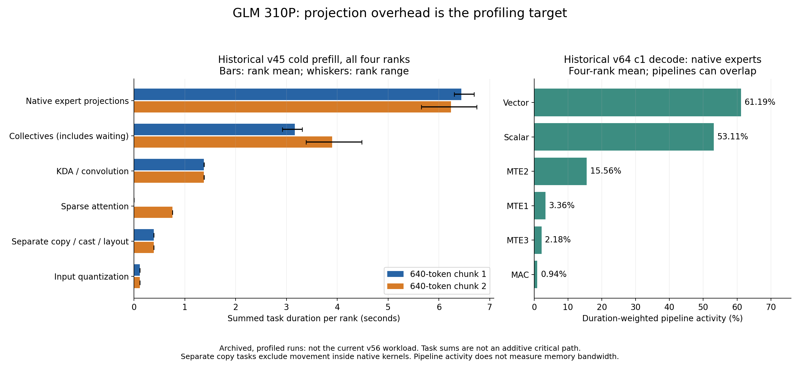

# GLM prefill: repeated weight and layout work

## Status

Source audit and archived trace analysis only. No candidate was applied and no
live measurements were collected in this session: the sandbox blocks SSH sockets
to the serving host. Runtime changes remain assigned to DeepSeek; this report is
the testing and profiling handoff. No server was stopped or weights reloaded.

The saved recovery configuration identifies `native_v56_prefill_graph`, TP4,
MTP1, a 640-token prefill budget and the permanent `cube_n128_k256_v1` layout.
That saved state is not a fresh inspection of the running process.

## What the reported iteration times establish

| Reported iteration | Work | Elapsed | Processed tokens/s |
| --- | --- | ---: | ---: |
| 5429 | 640 prompt tokens, one request | 14.44437 s | 44.31 |
| 5465 | Two generation tokens, one request | 0.23121 s | 8.65 |

These are different phases and token counts, not two equally sized prefill
iterations. The first is still slow for interactive coding. Generation-token
counts with MTP are not a direct substitute for user-visible accepted-token speed.

For comparing actual prefill iterations, retain token count, request mix, existing
context length, prefix-cache reuse, expert row distribution, graph dispatch and
per-rank timing. KV usage percentages alone do not establish a particular
request's context length. A full 640-token single-request chunk has a separate
piecewise graph; smaller chunks and mixed requests do not have that coverage.
The graph contains 46 segments and 45 dynamic state breaks. The reported
640-token latency cannot be attributed to a graph miss from these log lines.

Archived v45 equal-sized cold chunks took 12.533 s and 13.836 s. Rank0 expert
projection task sums were nearly constant (6.690 and 6.745 s); the second chunk
added 0.758 s of sparse-attention tasks and had longer collective task duration.
This is one concrete historical example of context-dependent prefill cost;
it is not attribution of the current 17:13:59 iteration.

## Concrete source findings for DeepSeek

Use the frozen [v56 source](../native-throughput-20261006/v56-source.cpp.txt)
and [provenance](../native-throughput-20261006/v56-provenance.json).

| Priority | Finding | Source location | Candidate to qualify |
| --- | --- | --- | --- |
| 1 | Expert rows are processed in batches of at most 15. Every `Accumulate` rereads scales, rounds FP32→FP16→FP32, then rereads/reconstructs each K256 weight tile. | Lines 107–114, 477–539 | A prefill schedule that reuses weight reconstruction and scale preparation across row batches of the same expert/output tile. Measure the retained accumulator/UB cost before increasing the working set. |
| 2 | Every INT4 Cube result is copied from L0C into UB, then split into column strips and cast to FP32. Per-group scaling, accumulation and many full barriers follow. | Lines 417–455, 543–579 | Reduce result readback, layout operations and barriers while preserving each block32 dot/scale and FP32 accumulation order. |
| 3 | Gate and up independently repeat input route/scales preparation in two `Accumulate` calls. | Lines 584–594, 500–508 | Share activation metadata/preparation across both projections without overwriting still-live intermediates. |
| 4 | Bulk down writes weighted FP32 routed rows, followed by a separate stable reducer. | Lines 693–713; helper lines 239, 256, 271–275 | A bounded stripe producer/reducer or equivalent route reduction that avoids a full-buffer round trip and preserves stable expert summation order. |

For an expert receiving 640 rows, the 15-row schedule creates 43 batches per
output tile/projection. The same weights are reread and W3 tiles reconstructed
for each batch. This is a static example, not a measurement of live expert loads.
W4 has a direct packed read; the costly W3 bit reconstruction is a different path.

The 640 × 8 × 4096 FP32 route workspace is **80 MiB per rank**. One full write
plus reducer read across 42 target MoE layers is **6.5625 GiB of logical traffic
per rank per chunk**. The scratch is shared, not allocated 42 times concurrently.
This estimate excludes MTP, hidden activations, scales, weights and cache access;
it is not measured bandwidth or proof that this buffer causes 14 seconds latency.

Avoid redoing work already present: input quantization is once per token and
shared among experts; permanent weight layout is prepared at checkpoint load;
bulk down already avoids walking all experts again for each 16-token chunk.
There is no full reconstructed FP16 weight workspace in this path.

## What the saved profiles show



The prefill plot uses the all-rank
[v45 attribution](../native-prefill-20261006/v45-attribution.json).
The pipeline plot uses the all-rank
[v64 decode attribution](../native-throughput-20261006/trace-v64-decode/attribution.json).
They are different historical versions and workloads, not current v56 telemetry.

Native projections dominated the historical prefill task sums. Separate copy/cast
tasks were about 0.39 s per rank/chunk, but that category does **not** count copies,
casts or weight reconstruction inside the fused native kernels.

Historical decode expert pipeline activity was roughly 61% vector, 53% scalar
and 0.94% MAC, duration weighted. Those pipelines overlap; the percentages do
not sum to utilization or identify memory bandwidth. They support investigating
packing, scale and readback work rather than establishing a memory bottleneck.

Collective durations include waiting for other ranks and can overlap other work.
Neither summing categories nor summing ranks produces a critical-path duration.

Reproduce the PNG and its JSON/hash evidence from the repository root:

```bash
python artifacts/glm-perf-310p/prefill-memory-audit-20261007/plot.py
```

## Temperatures

The supplied 89–94°C readings do not distinguish copies from arithmetic. Allocated
memory is not memory bandwidth. Thermal throttling is a plausible separate
explanation for changing latency, but neither temperatures nor `Health: OK`
establish current clock behavior. No throttling threshold is inferred here.
Huawei documents comparing current versus nominal AI Core frequency to investigate
[throttling](https://www.hiascend.com/document/detail/en/mindcluster/2610/toolbox/toolboxug/toolboxug_0106.html).
There is no clock sample for this run; no further user telemetry is required to
continue the source work.

## Next resident validation

1. Read current worker PIDs, candidate/bundle provenance, graph policy and weight
   storage digest before instrumenting. Compose the trace hook with the exact
   resident v56 candidate; do not substitute an older sinkhorn candidate or
   change checkpoint/layout. Frozen helper versions matter.
2. Capture one bounded all-rank 640-token prefill at representative existing
   context, followed by decode. Preserve live request state; do not clear caches
   underneath active requests. Record chunk index, request/context geometry,
   route counts and graph replay counters alongside host model-step boundaries.
3. Collect kernel CSVs and host/device copy API activity. Select supported
   PipeUtilization and memory counters; report unsupported fields as unavailable.
   Sample per-chip clocks during the same window when host access is available.
   Keep launch blocking off. This is a resident capture, not an `msprof` server
   relaunch. See the official
   [profiling options](https://www.hiascend.com/doc_center/source/en/CANNCommunityEdition/900/devaids/Profiling/atlasprofiling_16_0011.html).
4. Restore the exact candidate after stopping/finalizing the profiler. Check
   unchanged worker PIDs and weight storage, graph replay and a normal completion.
   No shutdown, model reload or hardware reset belongs in this protocol.
5. For DeepSeek's weight-reuse candidate, first check real-expert output parity
   and graph replay at partial/full row batches and routing boundaries. Preserve
   block32 scale rounding and expert reduction order. Measure unprofiled prefill
   and c4 serving after warmup using matched context/cache conditions; existing
   baselines are sufficient for choosing the experiment. Profile overhead is
   not a throughput benchmark. Keep the established model/tool quality gate.

The only immediate testing limitation is remote access. No speedup or deployed
fix is claimed by this audit.
