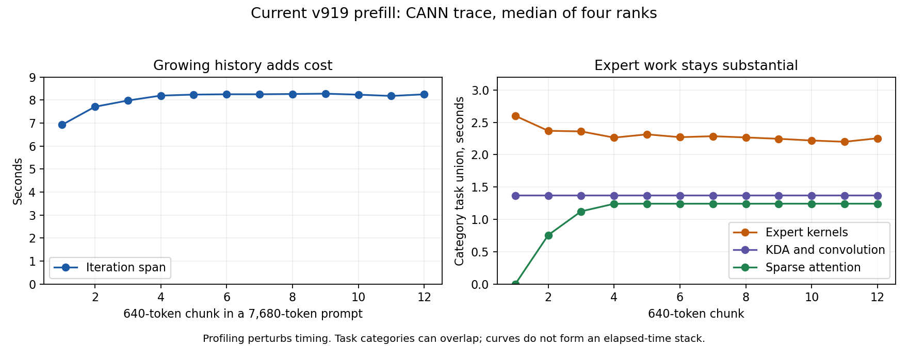

# GLM 310P：cold prefill 只复制 active KDA state rows

本轮先采集当前 v919 / v913 的四 rank CANN trace，再改 selected-state copy。
不重新转换权重、不修改永久模型 layout，也不降低 FP32 carry/math 精度。

## 640 tokens 为什么不是短 prompt 的三秒

同 ID42、seed42、max_tokens1、每次清空 prefix cache，v919 的独立128-token请求
**2.267 s**，独立640-token请求 **6.795 s**。两者 token 数不同；不能用前者的总时间
作为640-token chunk 的合理固定时间。这两条是单样本诊断，不是 paired benchmark。

当前四 rank profiling 中，7680-token请求分12个640-token chunks：host execute_model
median 首块 **6.807 s**，最后一块 **7.988 s**。CANN iteration markers 包含随后处理，
对应 **6.923 /8.250 s**，不能混为同一计时边界。Profiling 有扰动，不用它报告 speedup。

每 chunk task union 的四 rank median：KDA/conv 约 **1.370 s**，第一块 native experts
约 **2.601 s**、最后一块 **2.254 s**；后者 sparse attention 约 **1.243 s**。
后续 chunk 增加历史 attention，同时每个新 token 仍执行全部层的 projection、KDA、MoE。
任务类别可重叠，这些数不能相加当作关键路径；unreported task gap 也不等于设备空闲。

## 找到并移除全 bank materialization

trace 的 Index/IndexPut AsStrided/ViewCopy，每个 KDA layer 输出
`[688,16,128,128]` FP16，即 **344 MiB**，128与640 tokens 都约三次大 layout/copy。
三类任务在34层合计约 **0.399 s/rank/chunk**，远大于实际需要的一个 state row。
这是实际 op shape/任务时间，不把它解释成测得的 HBM traffic。

源码 `kda_310._run_prefill` 使用 `recurrent_state[state_indices]` 读取和写回；
paged cache 的 row stride 有 gap，通用 indexing materialize 了整个 bank。
实际 runtime geometry 是688 rows、payload262144 FP16元素、page stride327680元素。

- 新 AI-Core gather/scatter 通过 cache backing span 的 contiguous alias 和 page stride，
  只复制被选的 payload，保留 storage_offset 和所有 page gaps。每 active row **0.5 MiB**。
  BOOL fresh flag 直接写 FP16正零，然后调用原 FP32 promotion；writer 的原 `.to(FP16)` 保留。
- 只替换 prefill read/write 两处，chunk KDA、gate、normalization 和 FP32 recurrence不变。
  slots 保持 device INT32/INT64，不使用 `.item()` 或 CPU route/state 回传。
- 启动/paused 阶段准备 descriptors。第一轮错误地放在 apply hook，首次 activation
  进入旧 apply，所以 capture 时没有 model geometry。已改为新安装的 resident_capture hook，
  加入对应 first-activation regression UT。超出 serving prefill limit4的 dummy 走原路径。
- private caller 要求 scheduler-owned bounded slots、distinct write destinations；negative
  indices 按原 indexing wrap，duplicate gather 合法。默认 serve 不自动安装此实验。

## 验证与性能

CPU隔离 suite **605 passed**，包括 alias/storage offset/page gap、empty selection、无效 layout、
首次安装/capture准备顺序、oversized dummy bypass、manifest gate/hash 拒绝和两种 Cube prototype。
state copy 的 **16 hardware cases** 全通过；两种 index width、512/262144元素 payload、
0/192-element page gap、1/4 selected rows、changed graph replay、negative slots/fresh flags，
整个 backing 的 FP16 bit patterns逐位对照，包括其他 rows、prefix/suffix和padding。
另4个 nightly hardware cases覆盖 serving page stride327680，全部通过。
热加载另在每 rank验证4 cases；不对文本输出做质量评分，用户继续判读质量。

四条交错真实模型 cold1280请求，max_tokens1，重新 capture各候选后再每次清 cache：
**v919 median14.333903 s → state-row v925 median13.583243 s，减少5.24%**。
不是 kernel-only 数字；四 rank PID / weight storage digest不变，新640 prefill graphs replay>=2，
fallback dispatch=0、native_failed=false、graphs_dirty=false。保留 v925 state rows，MoE prefill
resource仍为 v919、decode resource仍为 v913。decoder math没有新增降精度。

cold7680 **96.503296 →92.283118 s，减少4.37%**；最终资格回执记录在
`measurements/validation.json`。
长7680比较只有每候选一个样本，不包装为多次统计结果。

## 已拒绝的 Cube readback schedules

两个 prototype 都通过66 paired real W2/W3/W4 × A4/A8 exact/replay、30 independent
math/replay、12 real-reference gates，但 live 更慢，未保留。

- v920 `--nz-prefill-accumulator`：dense A4在 native Cube布局用四个 unique FP32 scale
  factors累加，最后 bitwise row-copy；cold1280单对 **14.451 →17.329 s**，约增加19.92%。
- v921 `--prefill-product-cast`：完整 paired Cube结果一次 INT32→FP32原位 cast，再 copy
  active rows，保持原 scale/accumulation；交错 median **14.495 →14.886 s**，增加2.70%。
- 两个 flags 默认关闭、依赖检查和互斥校验已测试。实际调度/UB copies 的代价不能仅用
  少几个 cast/Mul 推断；保留 frozen evidence 供后续 profiling，不宣称它们加速。

早期 state copy v922/v923 在 standalone CLI 尚无 ACL context 时 load失败；v924 初始化
修复后16 gates通过，但首次 capture准备顺序错误，随后原 server原 workers恢复 v919，
unpaused。v925同时包含初始化、capture准备顺序和 dummy guard修复；失败原始日志保留。

## 复现与边界

`build_state_rows` 创建 append-only namespace/build，冻结 helpers、CPP、binary和bridge；
`state_rows_control.manifest` 要求 exact binaries与完整 replay/backing gates，再允许热加载。
原始 CANN CSV / SDK日志压缩归档，解压 SHA256 在 `raw-file-hashes.json`；冻结 `.py.txt`
恢复文件名并验证 provenance 才可执行。模型原 KDA源也随证据冻结。

现有 TP4/MTP1、max_model_len311040、batch tokens640、max_num_seqs4、永久磁盘权重与
prefix-cache设置不变。FULL decode2/8、单请求640 prefill 46 segments/45 eager breaks保持；
不宣称其他 geometry 全图化，也不把344 MiB temporary elimination 说成系统 free memory
增加344 MiB或 KV/context配额扩大。未修改 model runner、OPP搜索路径或新增 env变量。

API：`http://192.168.53.187:8001/v1/models`。
日志：
`/home/matteius/experiments/glm-reconstruction-20261006/serve-native-disk-head-nz-recovery-20261007-v2.log`。
