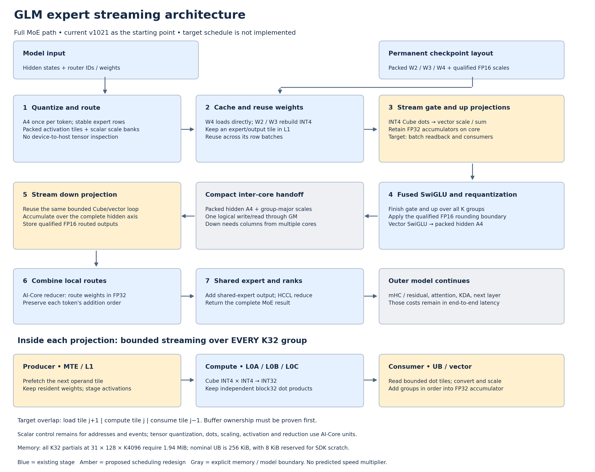

# Complete GLM expert streaming proposal

## US English

[Vector diagram](streaming-architecture.svg) ·
[Chinese companion](STREAMING.zh.md) ·
[Current measured trials](README.md).

The target processes every routed expert and every quantization group through
the complete gate/up, activation, down and combine pipeline. Bounded tiles are
a storage and scheduling choice, not a subset of model computation. This is a
design proposal; the live server still uses prefill v1021 and decode v984.

The existing path already performs native INT4 Cube multiplication and vector
scale multiplication. W4 loads its prepared codes directly; W2/W3 reconstruct
INT4 codes on core. Large expert batches already cache weights in L1 across row
batches. Requantization and SwiGLU are already inside the gate/up kernel. The
remaining problem is the fine granularity of operand loads, Cube readbacks,
layout conversion, scale broadcasting and ordering barriers.

## Streaming contract

1. Quantize input activations once per token and route the packed codes and
   scales into the consumer's tile layout using stable expert metadata.
2. Keep a resident expert/output weight tile in L1. Stream its row batches;
   rebuild W2/W3 codes only when the existing weight-cache lifetime requires it.
3. Stream all independent K32 dot products through the Cube, then apply their
   individual activation and weight scales with vector operations. Keep each
   output tile's FP32 accumulator on core until the full projection is complete.
4. Finish gate and up, preserving the qualified FP16 projection boundary.
   Apply SwiGLU and requantize directly into the down consumer's packed layout.
5. Read that compact handoff, stream the full down reduction axis, then perform
   stable route weighting/reduction, shared-expert addition and rank reduction.

The target schedule overlaps loading tile `j+1`, computing tile `j`, and
consuming tile `j-1`. This requires separately owned buffers, dependency events
and a demonstrated benefit on the unified 310P core. It is not established by
drawing three parallel lanes. Current product storage aliases dead decode
scratch; vector factor scratch aliases `mask_`. Adding a second live slot
without changing those lifetimes would corrupt data or exceed the UB budget.

The compact GM handoff between gate/up and down remains explicit. A gate/up
core produces only an intermediate-column tile; each down result needs the
complete intermediate axis, produced by multiple cores. Removing this handoff
requires a different ownership/dependency scheme and a memory proof. It cannot
be eliminated by assuming one core already owns the complete hidden tensor.
The routed-output handoff to the reducer and HCCL dependencies also remain.

Scalar control instructions still calculate addresses, issue operations and
coordinate events. The tensor arithmetic should use vector/Cube units. A
nonzero scalar counter does not prove scalar tensor arithmetic; eliminating
every scalar instruction is not a feasible execution contract.

## Why bounded tiles are necessary

With 31 valid rows, 128 output columns and K=4096, materializing every K32
partial product would require:

`31 × 128 × (4096 / 32) × 4 = 2,031,616 bytes = 1.9375 MiB`.

That excludes operands, scales, accumulators and output buffers. Nominal UB is
256 KiB, and this kernel additionally reserves 8 KiB for SDK scratch. The
current M32 product allocation uses 64 KiB for two INT32 product planes and
two FP32 planes, with a separate 16 KiB FP32 accumulator. Streaming discards
consumed partial products while retaining the accumulator. It covers all K
groups without creating a full-product GM workspace.

The block32 scale contract is essential: accumulating unscaled integer dots
across differently scaled groups and applying one scale at the end changes
the model. Batching readback must preserve the individual group factors and
FP32 addition order. Fused multiply-add or a larger quantization group is a
separate numerical candidate, not an interchangeable scheduling change.

## Evidence that motivates the design

The fresh four-rank v1021 trace contains all 576 matched collectives and 258
MoE layer/chunk calls per rank. Rank 0 attributes 15.258 seconds to gate/up,
7.013 to down, 1.442 to preparation and 1.361 to route reduction. Its device
stage reports 11.652 seconds of communication without overlap and only
0.154 seconds of device-free time. Graph replay may still help other workloads;
this trace does not support treating host launch gaps as the main cold-prefill
bottleneck.

One representative W4 gate/up task lasts 78.727 ms, with vector 56.604 ms,
scalar 26.077 ms and Cube MAC 1.201 ms. Pipe counters overlap and must not be
added together or extrapolated to every task. The sample supports inspecting
the complete readback/scaling/control schedule rather than expecting faster
INT4 multiplication alone to deliver a fourfold end-to-end improvement.

These observations come from [trace attribution](critical-attribution.json)
and [representative pipe counters](critical-pipe-samples.json), not an estimated
speedup. Communication wait includes dependencies and protocol effects; it is
not independently recoverable latency.

## Implementation acceptance criteria

- Prove UB/L1/L0 allocation bounds and overlapping buffer lifetimes before
  compiling an overlap candidate. No new full FP16 weight or partial-dot GM
  workspace.
- Cover gate, up, SwiGLU/requantization, down and stable combination, including
  sparse tails, zero-local-expert rows and changed graph replay inputs.
- Compare real W2/W3/W4 banks on all ranks against the retained arithmetic
  contract. Measure actual stage submissions and binary hashes.
- Profile scalar/vector/Cube/transfer counters and rank waits, then measure
  complete cold requests and decode. A faster isolated matmul is insufficient.

Source anchors: `Projection::Run`, `PrepareExpert`, `Accumulate`, `Product`,
`GateUp` and `Combine` in `tools/glm_perf/glm_fused_moe.cpp`; shared launch and
scratch lifetimes in `tools/glm_perf/glm_fused_moe.py`; final shared/rank combine
in `vllm_ascend/models/glm5next_w2/moe.py`.
