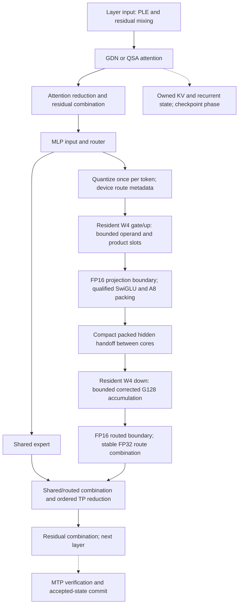

# Plan: Qwen streaming architecture on Ascend 310P

Date: 2026-10-09. Source baseline: `36ba88244`.
Status: T1–T8 completed offline; T9 hardware gate rejected v5 on October 9.
The image-enabled baseline is running for user testing. Further candidate work
is offline; no further NPU diagnostics or service mutations are planned.
Execution starts from clean commit `2a2a4e416`; unrelated workspace overlays are
excluded from the frozen reference and implementation worktree.

## Objective and scope

Improve the complete Qwen execution pipeline by keeping intermediate data close
to its consumers, bounding live storage, and scheduling work around explicit
dependencies. Optimize the architecture across stages, rather than accumulating
independent kernel substitutions. The GLM streaming proposal supplies useful
scheduling principles, but Qwen requires its own arithmetic and lifetime contract.

The first deliverable is a complete expert pipeline: token quantization and
device routing, gate/up, activation and packing, down, stable route combination,
shared expert, and rank reduction. The second integrates that pipeline with
attention, recurrent state, PLE, residual connections, and MTP. Both bulk prefill
and decode/speculative verification are explicit modes of the architecture.
Preserve image processing throughout; vision encoding remains a distinct stage.

No speed multiplier, thermal reduction, larger context capacity, or improvement
from overlap is assumed. Performance and sustained operation are acceptance gates.

## Current execution and target dataflow

Source anchors are `W4SparseMoE.forward`, `_forward_grouped_chunk`,
`_forward_routed`, and `PackedExpertBank` in
[w4_moe.py](vllm_ascend/models/qwen4_exp/w4_moe.py); `Schedule::LoadActivation`,
`Product`, `ProductPair`, `Project`, and `Store` in
[native_int4_schedule.h](csrc/gmm/qwen_w4_a8_int4_matmul_v310/op_kernel/native_int4_schedule.h).
The layer boundary is `AscendQwen4ExpDecoderLayer.forward` in
[model.py](vllm_ascend/models/qwen4_exp/model.py).

Bulk native gate/up already packs token inputs once per chunk, then gathers
packed operands into expert order. Weight tiles already remain in L1 across row
tiles. Small routed decode already broadcasts token operands to fixed route slots
and can fuse down/reduction for at most 30 routed rows. These are starting points,
not new promises.

The bulk path still materializes projected FP16 gate/up rows and uses a separate
activation stage. Depending on configuration, SwiGLU and activation packing are
fused together or run through the builtin FP16 activation path. Bulk down writes
routed rows for a separate finalizer. Existing offline metadata caching, local
route gather, state IO, WY, and TP chunk pipeline candidates must be incorporated
only after their individual gates; their composition is not already qualified.

## Contracts that the architecture must preserve

- Keep the packed W4 checkpoint and resident expert ownership. No persistent
  FP16 weight bank, new W8 shadow bank, or full partial-product GM workspace.
- Native W4 uses per-G128 A8 activation quantization represented by two signed
  INT4 limbs. Preserve scale, offset, weight-sum correction, FP32 operation and
  group-addition order, and FP16 projection/output boundaries. This A8 path is
  an existing approximation relative to W4A16, not newly equivalent to W4A16.
- Freeze the selected baseline's activation arithmetic. The builtin FP16
  SwiGLU path and FP32-SwiGLU-then-FP16 packing path must not be silently
  interchanged under a scheduling change. Quantizer rounding, zero handling,
  packed bytes, scale bits, and padding are part of the contract.
- Preserve route selection and renormalization, stable route order, exact-zero
  peer rows, shared-expert gating/placement, and collective ordering on all ranks.
- Keep required cross-core handoffs. Gate/up column ownership does not imply
  ownership of the complete intermediate axis needed by down. Gate and up halves
  also need an explicit pairing/ownership design before on-core activation fusion.
- Keep graph-visible addresses stable. No capture-time CPU route inspection,
  value-dependent Python shapes, stale padded rows, or blanket barrier removal.
- Preserve FP32 recurrent state, accepted-token commit semantics, cache identity,
  prefix CoW, cancellation, and image-enabled processing. Keep layer-specific
  QSA caches separate even when step metadata can be shared.

## Work packages and dependencies

The user invoked `$parallel-task qwen-streaming-plan.md` on 2026-10-09,
authorizing offline implementation and subagents. Dependencies describe order;
server changes, NPU execution, and a new hardware lease remain deferred.
Each package requires CPU regression tests and versioned evidence in
`artifacts/qwen38-streaming-upgrade/Tn/`. The offline builder and composition APIs
are implemented; live worker/scheduler adapter binding and qualification remain
deferred.

### T1: Freeze the reference and end-to-end evidence protocol

**depends_on**: []

**agent_type**: worker
**ownership**: `tools/qwen4exp/streaming_protocol.py`,
`tests/ut/qwen38_1m/test_streaming_protocol.py`, artifacts `T1/`.
**status**: Completed (offline reference preparation)
**log**: Worker verified 41 CPU tests, including concrete payload follow-up.
Git blob and submodule identities, 132 workload definitions, candidate and
evidence schema are frozen in `T1/reference-v2.json`. Historical
runtime is thermally unqualified; live identity and actual payloads remain pending
hardware qualification. No server queries.
**files edited/created**: `tools/qwen4exp/streaming_protocol.py`,
`tests/ut/qwen38_1m/test_streaming_protocol.py`, `T1/reference.json`,
`T1/tests.log` under the execution artifact root.

Freeze a clean source snapshot, coherent OPP/bridge/binary hashes, checkpoint
identity, dtype policy, dispatch, TP/EP, graph sizes, MTP, chunk/cache settings,
and image processor configuration. Do not treat historical launch settings as
current runtime state. Record staged candidates separately from serving baselines.

Define cold short/23K/long prefill, identical-prefix warm controls, C1/C2/C3/C4,
mixed prefill/decode, MTP0/1/2, and fresh/cached image cases. Freeze token IDs,
image hashes, generation limits, and real conversation/tool inputs. Hold capacity
fixed during architecture comparisons. Define a common provenance/evidence schema
before kernel, controller, or benchmark implementation.

Acceptance: complete reference/workload manifests; CPU tests reject incompatible
sources, missing rank receipts, mixed arithmetic baselines, and mislabeled cached
work. No runtime mutation or NPU allocation during reference preparation.

### T2: Prove memory ownership and the streaming ABI

**depends_on**: [T1]

**agent_type**: worker
**ownership**: `tools/qwen4exp/streaming_memory.py`,
`tools/qwen4exp/qwen_streaming_contract.h`,
`tests/ut/qwen38_1m/test_streaming_memory.py`, artifacts `T2/`.
**status**: Completed (offline byte and ownership proof)
**log**: Worker and coordinator verified 122 CPU tests.
Coverage includes generated-header host
compilation, aliases, event generations, startup/drain and unknown rank budgets.
The M16/N128 two-slot contract uses 140,032 UB bytes. SDK inspection opened no
device. The integrated kernel now compiles for dav-2002; device event ordering,
overlap and whole-rank fit remain hardware gates. Contract v3 includes the
dedicated cache/store control event and bounded column-window geometry.
**files edited/created**: `tools/qwen4exp/streaming_memory.py`,
`tools/qwen4exp/qwen_streaming_contract.h`,
`tests/ut/qwen38_1m/test_streaming_memory.py`, SDK snapshots, provenance and
`contract.json` in `T2/`.

Create a machine-checked byte/alignment/lifetime model for GM, UB, L1, L0A/B/C,
event IDs, route workspace, accumulators, packed activations, and output slots.
Cover producer acquire, ready, consumer release, startup, steady state, and drain.
Read installed SDK capacities and target-specific event rules without launching.

Design bulk and sparse schedules separately under one contract. Prove whether
load j+1 / Cube j / consume j-1 fits and can use independent storage on 310P.
Account for both activation limbs, metadata caching, paired gate/up ownership,
and scratch that survives each stage. Reduce internal microtiles if needed;
reject an infeasible overlap rather than naming the serial loop a new pipeline.

Acceptance: header/JSON interfaces agree; tests reject live aliases, unmatched
events, premature reuse, and overcommit. Include whole-rank memory with old/new
resources, graphs, cache archive, HCCL, shadow comparison, and verification scratch.

### T3: Stream token operands and routing into projections

**depends_on**: [T2]

**agent_type**: worker
**ownership**: `tools/qwen4exp/streaming_operands.py`,
`tools/qwen4exp/qwen_streaming_operands.h`,
`tests/ut/qwen38_1m/test_streaming_operands.py`, artifacts `T3/`.
**status**: Completed (offline producer implementation)
**log**: 31 CPU tests passed, including 100 executions of the native producer
against independent packed/layout/padding references. Hardware ordering pending.
**files edited/created**: `tools/qwen4exp/streaming_operands.py`,
`tools/qwen4exp/qwen_streaming_operands.h`,
`tests/ut/qwen38_1m/test_streaming_operands.py`, `T3/` receipts and report.

Keep quantization once per token. Compare device-indexed token operands against
compact local-expert packing; choose using complete transfer and projection cost,
not gather count alone. Device route boundaries control active work while physical
capacity stays bounded. Avoid packing or processing peer tails when not needed.

Reuse resident packed weights and compatible metadata across row tiles. Define
producer buffers and releases against T2; preserve stable order and graph padding.
Treat default W8A16 MTP host dispatch as a separate device-routing contract;
replacing it with W8A8 is not a scheduling-only optimization.

Acceptance: byte/scale/route parity; empty/skewed/all-peer and changing-route tests;
no new device-to-host route decisions or allocations proportional to all weights.

### T4: Integrate bounded gate/up and down product streaming

**depends_on**: [T2, T3]

**agent_type**: coordinator
**ownership**: `tools/qwen4exp/qwen_streaming_projection.h`,
`tools/qwen4exp/native_streaming.cpp`,
`tools/qwen4exp/native_streaming.py`,
`tests/ut/qwen38_1m/test_streaming_projection.py`, artifacts `T4/`.
**status**: Completed (offline native implementation)
**log**: 70 CPU tests execute the actual full/column native entries against an
independent numerical reference. Both entries compile with host-only CANN 9.1.0
ACLRTC for dav-2002. Event legality and overlap during device execution remain
pending. Source/binary identities are in `T4/host-compile-v3.json`.
**files edited/created**: Owned native projection/header/Python files, CPU SDK
stubs and projection test file, `T4/` report and receipts.

Implement acquired operand/product slots, batched Cube readback and vector
correction, retaining FP32 accumulators until each full projection is complete.
Preserve every G128 limb product and correction in baseline order. One integration
owner connects producer, Cube issue, consumer, and event allocation for both
projections; helper implementations do not independently alter the shared loop.

Acceptance: exact CPU arithmetic and address/event models; production geometries,
partial row/output tiles, changing experts, startup/drain, and cancellation-sensitive
sums. Compile-time bounds and measured task counters must identify actual schedule
selection. Host compilation is not hardware ordering or overlap validation.

### T5: Stream the activation handoff and finalization

**depends_on**: [T2, T4]

**agent_type**: worker
**ownership**: `tools/qwen4exp/qwen_streaming_epilogue.h`,
`tools/qwen4exp/streaming_epilogue.py`,
`tests/ut/qwen38_1m/test_streaming_epilogue.py`, artifacts `T5/`.
**status**: Completed (offline bounded handoff)
**log**: 41 CPU tests pass. Builtin FP16 activation remains unchanged; down uses
8/8/4 column windows with exact full-output reference checks. Maximum routed
output shrinks from 125 MiB to 50 MiB, but writes/reads survive and launches/copies
increase. No performance gain is claimed.
**files edited/created**: Owned epilogue Python/header/tests and `T5/` evidence.

Design paired gate/up tile ownership so qualified activation and packing can run
at the earliest valid boundary. Retain required FP16 rounding before consumers.
Prefer one compact packed-hidden GM handoff over full projected and activation
buffers where that is proven feasible. Down must consume the complete axis;
kernel-launch boundaries or a supported dependency scheme must establish readiness.

Design bounded down-output consumption and stable weighted reduction for bulk
routes. Evaluate output-tile ownership versus compact routed staging; avoid atomics
that change addition order. Existing small-route down/reduce fusion remains an
explicit sparse specialization, not evidence that bulk fusion is solved.

Acceptance: exact packed bytes, scales, FP16 outputs, and FP32 combined outputs;
tail shrink/growth, no-local routes, all output columns, and write ownership.
Document each surviving GM boundary and logical bytes per token/route/chunk.

### T6: Schedule shared work and rank communication

**depends_on**: [T1, T2, T5]

**agent_type**: worker
**ownership**: `tools/qwen4exp/streaming_schedule.py`,
`tests/ut/qwen38_1m/test_streaming_schedule.py`, artifacts `T6/`.
**status**: Completed (offline chunk scheduler)
**log**: 47 CPU tests cover all four ranks, shared placement, two-slot bounds,
completion before reuse and failure poisoning. Default 2560-token geometry gives
one chunk at the reference scheduler batch limit; smaller chunks need new gates.
Scratch remains per invocation. Device adapter is implemented but unexecuted.
**files edited/created**: Owned schedule Python/tests and `T6/` evidence.

Use fixed, rank-agreed chunks and bounded output slots. Submit reduction only
when routed and the configured shared contribution are ready. Evaluate overlapping
reduction of a completed chunk with independent computation of the next chunk.
Do not assume TP-sharded and replicated shared policies have the same add order.
Maintain stream allocator ownership and explicit completion before slot reuse.

Acceptance: faulted CPU dependency tests, matching collective sequence on all
ranks, bounded in-flight work, and no overwritten outputs. Compare whole-MoE
arithmetic: changing GEMM chunk shapes can change rounding. More collectives or
shared-expert contention must be measured rather than called automatic savings.

### T7: Integrate attention, state, PLE, and MTP lifetimes

**depends_on**: [T1, T2]

**agent_type**: worker
**ownership**: `tools/qwen4exp/streaming_layer.py`,
`tests/ut/qwen38_1m/test_streaming_layer.py`, artifacts `T7/`.
**status**: Completed (offline scoped layer composition)
**log**: 24 new CPU tests and 150 existing integration tests pass. Native state IO
and WY share one GDN hook; prefix phase barriers and PLE DMA ownership remain.
QSA graph-copy fusion and device accepted-state selection are not implemented.
**files edited/created**: Owned layer Python/tests and `T7/` evidence.

Extend the ownership contract beyond MoE. GDN should consume/return native state
layout without redundant transpose materialization, retain necessary layer/phase
completion, and checkpoint only valid completed states. Reuse accepted-token host
snapshots already produced for sampling; prove device-side state selection and
CoW ownership before removing remaining host decisions or clone scratch.

QSA should pass selected-page metadata directly into consumers, with bounded
query/page tiles and explicit gathers only at necessary layout boundaries.
Preserve causal masks, stable ties, logical positions, and layer cache identity.
PLE staging uses pinned bounded slots and completion-guarded reuse. Residual
mixing/combination and MTP target/draft tensors join the same lifetime table.

Acceptance: output and FP32 state parity, cold/warm prefix and CoW cases, mixed
attention boundaries, speculative acceptance/rejection, cancellation, changed
graph inputs, and image/text interleaving. Attention and MoE reductions remain
dependency boundaries unless an independently proven schedule can overlap them.

### T8: Compose one guarded, append-only candidate

**depends_on**: [T3, T4, T5, T6, T7]

**agent_type**: coordinator
**ownership**: `tools/qwen4exp/streaming_candidate.py`,
`tools/qwen4exp/build_streaming.py`,
`tools/qwen4exp/compile_streaming.cpp`,
`tools/qwen4exp/host_compile_sandbox.cpp`,
`tools/qwen4exp/streaming_resident.py`,
`tools/qwen4exp/resident_candidates/streaming.py`,
`tests/ut/qwen38_1m/test_streaming_candidate.py`,
`tests/ut/qwen38_1m/test_streaming_resident.py`,
`tests/ut/qwen38_1m/test_streaming_build.py`,
`tests/ut/qwen38_1m/test_host_compile_sandbox.py`, artifacts `T8/`.
**status**: Completed (offline guarded composition)
**log**: 39 composition, 49 builder, 37 controller and 17 real Linux containment
tests pass. The integrated suite passes 518 CPU tests. Final qwen_streaming_v5
compiles four binaries/six entries and a bridge for dav-2002 under enforced
Landlock/seccomp. Actual sources/artifacts/logs rehash successfully; 40 other-device
open attempts are denied and zero succeed. The preliminary uncontained v3 bundle
accessed manager nodes and is quarantined. No inference or server operations ran.
Real worker/scheduler binding, memory and all model/thermal gates remain T9 work.
**files edited/created**: All owned T8 source/tests above; `T8/build/`,
`T8/composition/`, `T8/controller/`, `T8/containment/`, `T8/host-build/`,
`T8/configuration.json` and `T8/configuration-identity.json`.

Integrate validated seams through an explicit candidate object/configuration,
not a stack of temporary monkey-patches whose ordering changes behavior. Reuse
plugin components and scoped hooks; avoid broad runner patches, new environment
variables, or mutable global state. Freeze/hash complete sources and binaries in
a unique bundle. Sparse/bulk/graph/mixed dispatch and unsupported cases are explicit.

Prepare a dry-run controller with generation/storage/manifest checks, complete
rank acknowledgments, idle/maintenance ownership, and restoration only after
this invocation may have mutated state. An unresolved collective timeout must
not trigger another collective or resume partially installed dispatch. This
package prepares recovery offline; it does not operate the server.

Acceptance: composition and fake-RPC failures pass; no library/kernel load or
live admission without matching gate evidence. CPU-only results remain labeled
offline candidates. A new source or binary hash invalidates dependent gates.

### T9: Qualify kernels, complete model behavior, and measured service gains

**depends_on**: [T1, T8]

**agent_type**: coordinator
**ownership**: artifacts `T9/`, final execution report and plan logs.
**status**: Needs retry (v5 rejected; baseline retained October 9)
**log**: Renewed hardware authorization enabled standalone tests on the third
card after disabling its ECC and activating the setting by isolated SMP reset.
TP6 is rejected by the model's 16 GDN key heads; the accepted baseline remains
TP4 on original logical devices 2–5. Image processing works for the tested
fresh/cached screenshot. Four scheduling slots share 937,737 cache tokens,
approximately 3.58 full 262,144-token contexts. Text/tool smoke passes six of
seven checks. All four real-weight expert partials match exactly, but streaming
is about 2 times slower at 128 tokens and 3.5 times slower at 2,560 tokens.
Native WY fails downstream GDN output parity; final-state validation is not reached.
The user requested retaining the faster baseline and is doing service testing.
All diagnostic jobs finished and the baseline was resumed. No streaming/WY
candidate was installed in its workers. Thermal parsing now handles the driver's
combined cells; 26 CPU regressions pass. Recorded maximum temperature is 72C,
with no sustained thermal or actual-temperature hold qualification. Source-based
follow-up targets vector instruction inflation, wider tiles, proven prefetch
ownership, boundary caching and fewer down windows. Profiler attribution remains
unmeasured. Full model/graph/cache/EP/MTP/thermal gates remain incomplete.
**files edited/created**: `artifacts/qwen38-streaming-upgrade/T9/RUNBOOK.md`,
`artifacts/qwen38-streaming-upgrade/T9/deferred-profile.json`, and
[October 9 hardware evidence and follow-up](artifacts/qwen38-streaming-upgrade/T9/hardware-20261009/REPORT.md).

The original qualification procedure below remains required for a new candidate.
Defer further hardware experiments while the user tests the baseline. Prove allocation headroom before
standalone tests with any loaded service. Serialize hardware work; do not unload
or shrink the service to make required coverage fit without authorization.
Run production-shape kernel parity and changed-input graph stress, then shadow
identical real activations/routes on every expert bank/layer and all four ranks.
Verify actual namespaces/binaries and stage submissions, not version strings alone.

Run at least three ABBA cycles per primary timing workload, with identical untimed
warmups, token IDs, generation limits, and cold/warm prefix policies. Report TTFT
to first generated token separately from first visible text, completed prefill
tokens, completion latency, decode throughput, rank skew, and peak memory.
Profile attribution separately; do not sum overlapping pipe counters.

Correlate all-rank DMA/cast/layout/event/HCCL traces with temperatures. Logical
payload estimates are not physical bus traffic or energy. Keep the 94°C hold,
all-core 85°C resume policy and independent 96°C cutoff; no candidate switching
or recapture during thermal hold. Include hold time in service results, and abort
testing if the controller cannot enforce the policy. Do not bypass missing sensors.

Promotion requires real-weight numerical/quality, image, cache/CoW, EP, MTP,
graph replay, and sustained thermal gates. Seek at least 10% improvement in
primary cold TTFT or sustained service throughput as an objective. A smaller
gain must exceed `max(2%, twice the maximum variant IQR/median)` over paired
trials; this repeatability rule is not a significance proof. Reject repeatable
decode or mixed-service regressions above 5%, capacity loss, or thermal cutoff.
Record inconclusive outcomes and retain the qualified reference if no defensible
overall gain is established. Publish the final evidence and runtime disposition.

## Execution order and completion

Start with T1 and T2 offline, then the complete expert path T3 through T6.
T7 addresses the rest of the layer under the same contract; T8 composes the
architecture. T9 needs a new candidate after the October 9 hardware rejection.
Existing GLM/Qwen edits and qualified runtime snapshots must remain intact.

T1–T8 now implement the offline candidate, with execution evidence in the
[streaming report](artifacts/qwen38-streaming-upgrade/REPORT.md). The deferred
[qualification runbook](artifacts/qwen38-streaming-upgrade/T9/RUNBOOK.md)
records remaining worker/scheduler binding, hardware gates and promotion limits.
No candidate is installed in the live baseline workers. October 9 standalone
hardware results and the offline follow-up are linked above. Previously staged component candidates
and their CPU/build evidence are described in the
[transfer report](artifacts/qwen38-transfer-next-20261009/REPORT.en.md) and
[earlier offline report](artifacts/qwen38-five-offline-20261009/REPORT.en.md).
Their hardware, end-to-end, and thermal gains remain unqualified.

## Planning and execution validation

Local-link and dependency checks passed: five source/report links and nine
ordered work packages. Scoped manual repository hooks passed for the plan and
policy changes. Repository-wide `bash format.sh ci` reported existing unrelated
lint/format failures; its unrelated formatter changes were restored in the
isolated worktree. That was the original planning-only validation.

Execution validation now passes 518 CPU tests and scoped manual checks. The final
contained CANN build and actual source/binary/bridge/log byte checks pass. An
uncontained preliminary compiler's manager-device accesses are documented and
quarantined; containment rejects subsequent opens. No inference or server tests
ran during that offline implementation phase. The October 9 hardware gate
subsequently rejected v5, as recorded under T9. Repository-wide CI retains unrelated failures; formatter changes to 144
unrelated files were restored in the isolated worktree. A broader regression
group gives 179 passes and four GDN CPU-stub failures identically on the clean
unchanged baseline. Full receipts and limitations are in the execution report.
